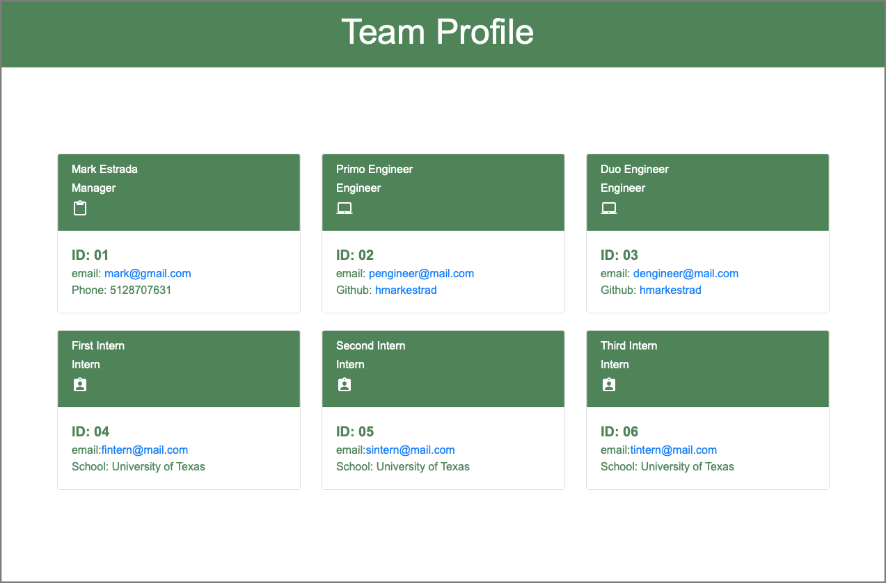

<h1 align="center">Object-Oriented Programming Team Profile Generator</h1>

  
## Table of Contents
- [Table of Contents](#table-of-contents)
- [Description](#description)
- [Usage](#usage)
- [Screenshot](#screenshot)
- [Contributions](#contributions)
- [License](#license)
- [Installation](#installation)
- [Testing](#testing)
- [Questions](#questions)
  
## Description
I have developed a Node.js command-line application that takes in information about employees on a software engineering team and generates an HTML webpage that displays summaries for each person. Because testing is key to making code maintainable, I wrote unit tests for each part of my code and ensured that it passed all of them.  
  
Because this application won’t be deployed, I’ll also need to provide a link to a walkthrough video that demonstrates its functionality and all of the tests passing. You’ll need to submit a link to the video and add it to the README of your project.

## Usage
Use this application to generate a project README.md file.
  
## Screenshot:  
  
  
## Contributions
H. Mark Estrada
  
## License
 
This application is covered by the MIT license. 
  
## Technologies

 

  
## Installation
After cloning the GitHub Repository run the following commands at the root of your project:   
`npm install node` `npm install` `npm install inquirer` `npm install jest`   
  
## Testing
To run Jest for tests on constructors: `npm test`  
  
## Questions
GitHub: [hmarkestrad](https://github.com/hmarkestrad) 
Contact me with any questions: h.mark.estrada@gmail.com 
Copyright 2022 © H. Mark Estrada. All Rights Reserved. 